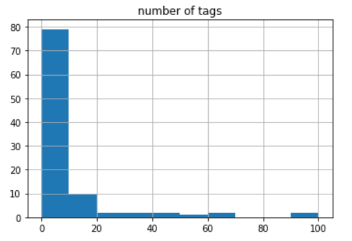

**Exploratory Data Analysis**

Our project utilized two primary data sources:
* [The Million Song Dataset](https://labrosa.ee.columbia.edu/millionsong/lastfm)
* [The Million Playlist Dataset](http://recsys-challenge.spotify.com)

**Million Songs Dataset**

The Million Song Dataset contains the top one million songs played on Spotify, by number of plays. We began by cleaning the data. We uploaded the list of songs as a text file, and ran a for loop by line, and used the split method to separate the artist name and track name. Next, we made a function to generate the tags using the last.fm API, and created a function that cleaned (again using the split method) and added tags in a list based on the artist and track names. Lastly, we loaded all of the cleaned data into a pandas dataframe, and added a column counting the number of tags attached to each song.

To explore the data, we initially looked at the first 500 unique tracks. For each song in this dataset, we were interested in retrieving the following information:
* Track name
* Artist
* Number of tags
* User-generated tags

We next performed some additional exploratory analysis to look at the average number of tags per song, the number of songs tagged with each genre, and the proportion of songs.

Figure 1: Histogram of Number of Songs (Y) and Number of Tags (X) from the Million Songs Dataset



An important insight from the initial data exploration of the first 500 unique songs in the Million Songs Dataset is that 80% have very few tags (between 0 and 10). This could be the case that only a few tags are actually valuable. As a group, we will therefore have to make decisions about how to deal with songs that have very few or no tags. For example, we can generate our own tags or simply eliminate these songs from consideration. 

**Million Playlist Dataset**

The Million Playlist Dataset contains the top one million playlists on Spotify, by number of followers. We cleaned the data by writing two python scripts: one to load the dataset into a csv file, and another to clean the data. We cleaned the data by normalizing names of the playlists (rewrote names in lowercase, removed special characters, and removed extraneous spaces) and removing irrelevant columns (collaborative, modified at, number of edits).

To explore the data, we initially looked at the first 1,000 playlists. We pulled the following information:
* Duration of playlists in minutes
* Time when playlist was last edited
* Number of albums in each playlist
* Number of artists in each playlist
* Number of followers in each playlist
* Number of tracks in each playlist


```python

```

